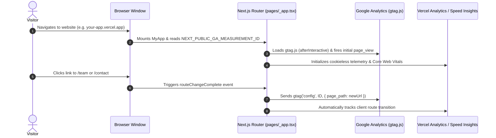

# 📊 Analytics Architecture & Implementation Plan

This plan outlines the dual-tracking strategy for **Google Analytics 4 (GA4)**, **Vercel Web Analytics**, and **Vercel Speed Insights** on the SAGE website, optimized for the current **`*.vercel.app` subdomain** with seamless transition to a **future custom domain**.

---

## ⚖️ 1. Pros & Cons Analysis

### A. Vercel Web Analytics & Speed Insights
| Aspect | Pros | Cons |
| :--- | :--- | :--- |
| **User Privacy** | 🟢 **100% Cookieless** — No cookie consent banner or GDPR popups needed. | 🔴 Limited behavioral segmentation (cannot build complex audience remarketing lists). |
| **Accuracy** | 🟢 Not blocked by standard ad-blockers (Brave, uBlock Origin) since it runs through Vercel's edge network. | 🔴 Free tier on Hobby plan is capped at basic metrics. |
| **Performance (Speed Insights)** | 🟢 Measures real-world Core Web Vitals (LCP, INP, CLS) per URL and device type directly. | 🔴 Focuses on technical performance rather than conversion funnels. |
| **Setup on `.vercel.app`** | 🟢 **Instant zero-config** — Automatically detects production vs. preview deployments. | 🔴 Metrics are tied to your Vercel project dashboard. |

### B. Google Analytics 4 (GA4)
| Aspect | Pros | Cons |
| :--- | :--- | :--- |
| **Marketing & SEO** | 🟢 Direct integration with **Google Search Console** and Google Ads; deep search query visibility. | 🔴 ~15–25% of tech-savvy visitors block GA scripts via ad-blockers. |
| **Custom Conversion Funnels** | 🟢 Tracks specific actions: Contact Form submissions, phone/email clicks, syllabus downloads. | 🔴 Uses cookies; requires compliance handling if collecting user identifiers. |
| **Demographics & Geography** | 🟢 Detailed breakdown of visitor countries, cities, referral sources, and device tech. | 🔴 Steeper learning curve in the GA4 reporting UI. |
| **Setup on `.vercel.app`** | 🟢 Works out of the box on any domain/subdomain with `G-XXXXXXXXXX`. | 🔴 Can get polluted with staging/preview traffic if not filtered by environment. |

### C. The Hybrid Strategy (Recommended)
* **Vercel Analytics + Speed Insights**: Handles technical health, Core Web Vitals, and unfiltered, cookieless visitor totals.
* **Google Analytics 4**: Handles marketing attribution, search engine queries, and conversion tracking on the contact form.

---

## 🌐 2. Vercel Subdomain (`.vercel.app`) vs. Custom Domain Handling

### How to configure on a Subdomain now:
1. **Google Analytics Data Stream**:
   - In GA4, set the Stream URL to `https://your-project.vercel.app`.
   - GA4 tracks events based on the **Measurement ID (`G-XXXXXXXXXX`)**, regardless of the hostname.
2. **Environment Scoping**:
   - GA4 script will only load when `NEXT_PUBLIC_GA_MEASUREMENT_ID` is defined.
   - We will configure it to ignore `localhost` so development and automated E2E tests (`yarn test:e2e`) don't send fake traffic to your dashboard.
3. **Vercel Analytics**:
   - Vercel automatically attaches analytics to your assigned `.vercel.app` production deployment.

### How it transitions when you get your Custom Domain later:
- **Zero code changes required!**
- When you connect `sageglobal.org` in Vercel, Vercel updates analytics automatically.
- In Google Analytics, you simply edit the Web Stream URL display name to `https://sageglobal.org`. Historical data remains 100% intact.

---

## 🛠️ 3. Technical Implementation Details

### Stack Context:
- **Framework**: Next.js 12 (Pages Router) + React 18
- **Packages**:
  - `@vercel/analytics`
  - `@vercel/speed-insights`
  - `next/script` (built-in Next.js script loader)

### Dynamic Route Change Tracking (Crucial for Pages Router):
Because Next.js Pages Router navigates client-side without full page reloads, we must attach a listener to `router.events` so that each page change (`/`, `/about`, `/team`, `/contact`, `/services`, etc.) records a `page_view` in GA4.

---

## 📋 4. Step-by-Step Execution Plan

### Step 1: Install Dependencies
- Install `@vercel/analytics` and `@vercel/speed-insights` using `yarn add`.

### Step 2: Create Google Analytics Helper Module
- Create `lib/analytics.ts` with helper utilities:
  - `pageview(url)`
  - `event({ action, category, label, value })` for tracking conversions (e.g. contact form submission).

### Step 3: Integrate with `pages/_app.tsx`
- Add `next/script` tags for Google Tag Manager (`gtag.js`) conditional on `NEXT_PUBLIC_GA_MEASUREMENT_ID`.
- Hook into `router.events` (`routeChangeComplete`) for single-page navigation tracking.
- Insert `<Analytics />` and `<SpeedInsights />` components.

### Step 4: Add Contact Form Conversion Event
- In `components/ContactForm.tsx`, trigger `event({ action: 'submit_contact_form', category: 'Engagement' })` on successful Resend email dispatch.

### Step 5: Configure Environment Variables
- Add `NEXT_PUBLIC_GA_MEASUREMENT_ID` to `.env.example` and local `.env.local` instructions.
- Provide step-by-step instructions for Vercel Dashboard project settings.

### Step 6: Validate with Local Build & E2E Tests
- Run `yarn tsc` and `yarn test:e2e` to verify 0 regressions.
